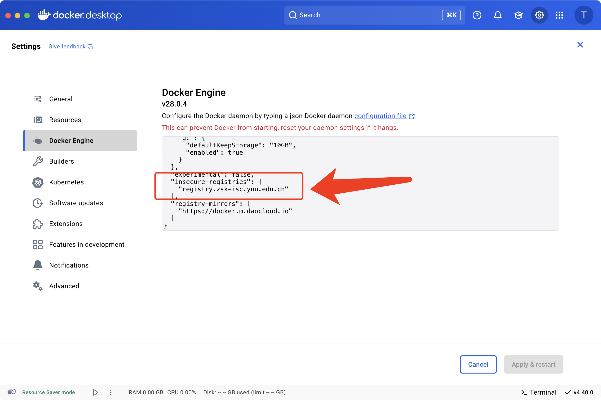

# 云南省智能系统与计算重点实验室镜像仓库

## 简介

这是云南省智能系统与计算重点实验室 Docker 镜像仓库服务（Docker Registry），提供镜像存储、分发和管理功能。本服务可用于实验室研究项目的容器化部署、开发环境的搭建以及教学科研活动。

**仓库地址：** https://registry.zsk-isc.ynu.edu.cn （✓ 已验证可用）

## 功能特点

- **镜像存储与管理**：安全存储 Docker 镜像，支持多标签管理（✓ 已验证）
- **高速访问**：实验室内部高速网络访问，避免从外部仓库拉取时的网络延迟
- **无大小限制**：支持任意大小的镜像推送和拉取（✓ 已验证）
- **简单易用**：兼容 Docker 标准操作，无需学习新的命令（✓ 已验证）

## 使用前准备

由于使用了自签名证书，您需要在不同环境下进行以下配置：

### Windows 环境 (Docker Desktop)

1. 打开 Docker Desktop
2. 点击右上角的⚙️图标进入设置
3. 选择 "Docker Engine" 选项卡
4. 在 JSON 配置中添加以下配置：

```json
{
  "experimental": false,
  "insecure-registries": [
    "registry.zsk-isc.ynu.edu.cn"
  ],
  "registry-mirrors": [
    "https://docker.m.daocloud.io"
  ]
}
```

5. 点击 "Apply & Restart" 按钮应用更改并重启 Docker Desktop



### WSL 环境 (Ubuntu 24.04)

在 WSL 的 Ubuntu 24.04 中配置 Docker：

1. 如果尚未安装 Docker，请先安装：

```bash
sudo apt update
sudo apt install docker.io
sudo systemctl start docker
sudo systemctl enable docker
sudo usermod -aG docker $USER
# 重新登录使用户组设置生效
```

2. 创建或编辑 Docker 配置文件：

```bash
sudo mkdir -p /etc/docker
sudo nano /etc/docker/daemon.json
```

3. 添加以下内容：

```json
{
  "insecure-registries": ["registry.zsk-isc.ynu.edu.cn"],
  "registry-mirrors": ["https://docker.m.daocloud.io"]
}
```

4. 保存文件（Ctrl+O，然后 Enter，再按 Ctrl+X 退出）

5. 重启 Docker 服务：

```bash
sudo systemctl restart docker
```

### Linux 服务器环境（推荐配置方式）

编辑 `/etc/docker/daemon.json` 文件（如果不存在，请创建它）：

```bash
sudo mkdir -p /etc/docker
sudo tee /etc/docker/daemon.json > /dev/null << EOF
{
  "insecure-registries": ["registry.zsk-isc.ynu.edu.cn"],
  "registry-mirrors": ["https://docker.m.daocloud.io"]
}
EOF
```

然后重启 Docker 服务：

```bash
sudo systemctl restart docker
# 或
sudo service docker restart
```

## 基本使用指南

### 拉取镜像（✓ 已验证）

从镜像仓库拉取已有镜像：

```bash
docker pull registry.zsk-isc.ynu.edu.cn/nginx:latest
```

### 推送镜像

1. 首先拉取或创建您需要的镜像
2. 为镜像添加我们仓库的标签
3. 推送到仓库

```bash
# 示例：推送一个 Nginx 镜像
# 1. 拉取镜像 (使用 DaoCloud 加速)
docker pull m.daocloud.io/docker.io/library/nginx:latest

# 2. 标记镜像
docker tag m.daocloud.io/docker.io/library/nginx:latest registry.zsk-isc.ynu.edu.cn/my-nginx:v1

# 3. 推送镜像
docker push registry.zsk-isc.ynu.edu.cn/my-nginx:v1
```

### 查看镜像列表（✓ 已验证）

查看仓库中的所有镜像：

```bash
curl -k https://registry.zsk-isc.ynu.edu.cn/v2/_catalog
```

查看特定镜像的标签：

```bash
curl -k https://registry.zsk-isc.ynu.edu.cn/v2/nginx/tags/list
```

## Windows 特定说明

### Docker Desktop 镜像存储位置

Docker Desktop 在 Windows 上的镜像默认存储在 WSL2 虚拟磁盘中。如果你需要保存磁盘空间：

1. 打开 Docker Desktop 设置
2. 进入 "Resources" > "WSL Integration"
3. 配置资源限制和集成选项

### WSL 与 Docker Desktop 集成

如果您在 WSL 中工作，同时使用 Windows 的 Docker Desktop：

1. 确保在 Docker Desktop 设置中启用了 WSL 集成
2. 在 WSL 终端中可以直接使用 docker 命令而不需要额外安装
3. Docker 配置（包括 insecure-registries）将从 Docker Desktop 继承

## 在 Kubernetes 中使用

### 在 Pod 配置中使用镜像

```yaml
apiVersion: v1
kind: Pod
metadata:
  name: my-app-pod
spec:
  containers:
  - name: my-app
    image: registry.zsk-isc.ynu.edu.cn/my-app:latest
```

### 配置 containerd 使用镜像仓库

如果您使用 Kubernetes 和 containerd，添加以下配置到 `/etc/containerd/config.toml`：

```toml
[plugins."io.containerd.grpc.v1.cri".registry.mirrors."registry.zsk-isc.ynu.edu.cn"]
  endpoint = ["https://registry.zsk-isc.ynu.edu.cn"]
[plugins."io.containerd.grpc.v1.cri".registry.configs."registry.zsk-isc.ynu.edu.cn".tls]
  insecure_skip_verify = true
```

然后重启 containerd 服务：

```bash
sudo systemctl restart containerd
```

## 使用 DaoCloud 镜像加速

本镜像仓库服务集成了 DaoCloud 镜像加速功能，建议通过以下方式使用：

1. 从 DaoCloud 加速源拉取镜像
2. 标记镜像并推送到我们的仓库
3. 在应用中使用我们仓库中的镜像

```bash
# 示例：使用 DaoCloud 加速拉取 Ubuntu 镜像并推送到我们的仓库
docker pull m.daocloud.io/docker.io/library/ubuntu:22.04
docker tag m.daocloud.io/docker.io/library/ubuntu:22.04 registry.zsk-isc.ynu.edu.cn/ubuntu:22.04
docker push registry.zsk-isc.ynu.edu.cn/ubuntu:22.04
```

## 最佳实践

1. **使用具体版本标签**：避免使用 `latest` 标签，推荐使用具体的版本号如 `v1.0.0`
2. **镜像命名规范**：使用有意义的名称，推荐格式 `项目名/应用名:版本号`
3. **定期清理本地缓存**：使用 `docker system prune` 清理未使用的镜像
4. **构建小体积镜像**：使用多阶段构建和精简基础镜像
5. **推送前本地测试**：确保镜像在本地能正常运行后再推送
6. **使用国内镜像加速**：推荐使用 DaoCloud 镜像加速服务提升拉取速度

## 故障排除

### 常见问题处理

1. **推送失败**
   - 检查 Docker 配置中是否添加了不安全仓库配置
   - 确认网络连接正常
   - 对于大镜像，耐心等待推送完成

2. **拉取失败**
   - 确认镜像名称和标签正确
   - 检查网络连接
   - 尝试先清理本地缓存：`docker system prune`

3. **证书问题**
   - 确保正确配置了 insecure-registries
   - 尝试使用 `-k` 参数忽略 SSL 验证：`curl -k https://registry.zsk-isc.ynu.edu.cn/v2/`

## 技术支持

如遇到任何问题，请联系胡老师。

## 相关资源

- [Docker 官方文档](https://docs.docker.com/)
- [Kubernetes 官方文档](https://kubernetes.io/docs/home/)
- [DaoCloud 镜像加速服务](https://github.com/DaoCloud/public-image-mirror)
- [Docker Desktop 文档](https://docs.docker.com/desktop/windows/)
- [WSL 文档](https://learn.microsoft.com/zh-cn/windows/wsl/)

---

*本文档最后更新于：2024年4月11日* 